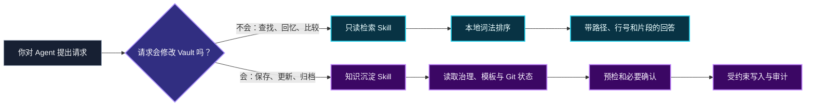

<p align="center">
  
</p>

<h1 align="center">Obsidian Knowledge Base Skill</h1>

<p align="center">
  <strong>让 AI 助手安全地检索、沉淀和治理你的 Obsidian 知识库</strong>
</p>

<p align="center">
  <a href="https://github.com/Spc-jgs/obsidian-kb-skill/releases/latest"></a>
  <a href="https://github.com/Spc-jgs/obsidian-kb-skill/actions/workflows/check.yml"></a>
  
  <a href="LICENSE"></a>
  
</p>

<p align="center">
  <a href="#让-agent-安装推荐">快速安装</a> ·
  <a href="#功能地图">功能地图</a> ·
  <a href="docs/README.md">完整文档</a> ·
  <a href="README_EN.md">English</a> ·
  <a href="CHANGELOG.md">版本记录</a>
</p>

<table>
  <tr>
    <td align="center"><strong>🔎 只读检索</strong><br><sub>本地排序，回答可追溯到文件和行号</sub></td>
    <td align="center"><strong>✍️ 受控沉淀</strong><br><sub>只有明确授权并通过预检后才写入</sub></td>
    <td align="center"><strong>🧩 多平台共用</strong><br><sub>Codex、QoderWork、WorkBuddy、Claude Code、Cursor</sub></td>
  </tr>
</table>

一个仓库包含两个职责分离的 Skill：`obsidian-knowledge-retrieval` 负责只读搜索、引用和问答；`obsidian-knowledge-base` 仅在用户明确授权后创建、更新和治理笔记。当前稳定版本为 **v1.26.4**。

## 一图看懂



检索不会因为“可能有帮助”而获得写权限；写入也不会因为普通问答自动发生。即使一句话同时要求“先查再保存”，两个 Skill 仍按各自的权限边界依次工作。

## 为什么需要它

AI 对话里产生的方案、会议结论、学习记录和排障经验很容易随着聊天结束而消失。手工整理又需要反复决定目录、模板、标签、链接和索引，摩擦很大。

这个项目把知识库规则交给 Agent，把路径校验、检索、模板渲染、索引检测和审计等确定性步骤交给本地 helper。你只需要表达意图：

```text
在我的 Obsidian 里找一下，我们之前如何处理多 Agent 交接？

把这次架构评审的结论沉淀到知识库。

复盘这次对话，找出值得长期保存的问题、知识、反思和设计；低价值内容不要写。

剪藏这篇文章，保留原理、实践步骤、验证方式和来源证据。
```

## 两个 Skill，两个权限边界

| | 只读检索 | 知识沉淀与治理 |
|---|---|---|
| Skill | `obsidian-knowledge-retrieval` | `obsidian-knowledge-base` |
| 典型触发 | 搜索、查找、回忆、比较、基于 Vault 回答 | 保存、创建、更新、归档、记住 |
| Vault 写入 | 永不写入 | 仅明确授权并通过预检后 |
| 核心输出 | 相对路径、标题、行号、片段、匹配原因 | 笔记路径、变更摘要、审计结果 |
| 本地 helper | `search-vault`、`vault-info`、`doctor` | 创建、更新、分类、索引、链接、审计等 |

检索 v1 使用确定性的本地词法排序，不需要 embedding 模型、向量数据库、常驻服务或联网索引。标题、别名、标签、标题层级、wikilink 和正文按不同权重参与排序。详见[只读检索](docs/retrieval.md)。

## 功能地图

| 能力 | 你能得到什么 | 详细指南 |
|---|---|---|
| 只读知识检索 | 可追溯到文件和行号的搜索结果与回答 | [只读检索](docs/retrieval.md) |
| 八种预置笔记 | 日记、会议、学习、网页、洞察、项目、人物、摘要 | [完整功能指南](docs/feature-guide.md) |
| 韧性网页沉淀 | 普通文章快速保存，访问失败安全换路，重要内容可升级求证 | [知识沉淀与治理](docs/capture-and-governance.md) |
| 对话上下文与知识萃取 | 分层恢复目标、状态、决定和证据，筛选长期知识候选 | [对话上下文恢复与知识萃取](docs/conversations.md) |
| Vault 自定义治理 | 服从 `AGENTS.md`、自定义模板、目录和索引所有权 | [知识沉淀与治理](docs/capture-and-governance.md) |
| 安全创建与更新 | dry-run、路径边界、模板哈希、Git 预检、写后审计 | [完整功能指南](docs/feature-guide.md) |
| 新分类与 Inbox | 确认后建分类，先预览再归档 Inbox | [知识沉淀与治理](docs/capture-and-governance.md) |
| 链接与索引 | wikilink 建议，兼容 Folder Index、Dataview、静态 INDEX | [知识沉淀与治理](docs/capture-and-governance.md) |
| Task Memory | 可选的多 Agent 长任务交接日志和有限备份 | [知识沉淀与治理](docs/capture-and-governance.md) |
| 安装与诊断 | 多平台安装、payload 校验、双 Skill `doctor` | [平台与安装](docs/platforms-and-installation.md) |

完整命令清单、安全策略和笔记类型见[完整功能指南](docs/feature-guide.md)。

## 开始前

- Python 3.11 或更高版本；
- 一个现有 Obsidian Vault，或一个准备作为 Vault 的目录；
- 支持 Skill 或项目规则的 AI Agent。

## 让 Agent 安装（推荐）

把下面这段话直接发给 Codex、QoderWork、WorkBuddy、Claude Code、Cursor 或其他具备终端和文件读写能力的 Agent：

```text
请从官方仓库 https://github.com/Spc-jgs/obsidian-kb-skill 安装最新稳定版 Obsidian Knowledge Base Skill。

先阅读 README、安装器帮助和 CHANGELOG，再使用官方安装器。识别当前平台和我的 Obsidian Vault；无法可靠判断时先询问我，不要猜路径。保留我的 Vault 内容、自定义模板和其他平台配置，不要强制覆盖。

安装完成后，请从非仓库目录分别运行写入与检索 Skill 的 doctor --json，再执行一次只读检索 smoke test。向我报告版本、Vault 路径、安装平台、安装位置和验证结果；检查失败时停止，不要删除或重建 Vault。
```

更完整的首次使用步骤和验收标准见[快速开始](docs/getting-started.md)。

## 手动安装与下载

### Git 克隆

```bash
git clone https://github.com/Spc-jgs/obsidian-kb-skill.git
cd obsidian-kb-skill
```

也可以从 GitHub 的 **Code → Download ZIP** 下载后解压。

macOS / Linux：

```bash
chmod +x install.sh
./install.sh --vault "/你的/Vault"
```

Windows PowerShell：

```powershell
.\install.ps1 -VaultPath "C:\你的\Vault"
```

首次安装必须显式给出 Vault 路径。再次运行时会复用 `~/.obsidian-kb-config` 里保存的路径，此时可以省略该参数。

安装器会初始化缺失的目录与模板，安装平台入口和私有 helper runtime，并从中立目录验证两个 Skill。

如果只想检查选项：

```bash
./install.sh --help
```

```powershell
.\install.ps1 -Help
```

标准 Skill 必须包含完整目录：

- [skills/obsidian-knowledge-base/SKILL.md](skills/obsidian-knowledge-base/SKILL.md)
- [skills/obsidian-knowledge-retrieval/SKILL.md](skills/obsidian-knowledge-retrieval/SKILL.md)

**单独复制一个指令文件既不是完整标准 Skill，也不会初始化 Vault。** Claude Code 和 Cursor 的写入兼容入口仍依赖安装器部署的产品 runtime。详细的平台差异、安装路径、升级和卸载方式见[平台与安装](docs/platforms-and-installation.md)。

## 支持平台

| 平台 | 写入入口 | 只读检索入口 |
|---|---|---|
| Codex / Agent Skills | `~/.agents/skills/obsidian-knowledge-base/` | `~/.agents/skills/obsidian-knowledge-retrieval/` |
| QoderWork / Qoder CLI | `~/.qoderwork/skills/obsidian-knowledge-base/` | `~/.qoderwork/skills/obsidian-knowledge-retrieval/` |
| WorkBuddy | `~/.workbuddy/skills/obsidian-knowledge-base/` | `~/.workbuddy/skills/obsidian-knowledge-retrieval/` |
| Claude Code | `~/.claude/skills/obsidian-knowledge-base/` | `~/.claude/skills/obsidian-knowledge-retrieval/` |
| Cursor | `~/.cursor/rules/obsidian-kb.mdc` | `~/.cursor/skills/obsidian-knowledge-retrieval/` |

同一产品可以安装到多个平台并共用一个 Vault。平台选择、区域选择、配置优先级和卸载边界见[平台与安装](docs/platforms-and-installation.md)。

## 文档导航

| 文档 | 适合什么时候看 |
|---|---|
| [文档首页](docs/README.md) | 不确定从哪里开始 |
| [快速开始](docs/getting-started.md) | 第一次安装、验证和调用 |
| [完整功能指南](docs/feature-guide.md) | 想了解所有能力与 CLI |
| [只读检索](docs/retrieval.md) | 想理解排序、范围、引用和限制 |
| [知识沉淀与治理](docs/capture-and-governance.md) | 想创建、更新、剪藏或治理笔记 |
| [对话上下文恢复与知识萃取](docs/conversations.md) | 想归档一次讨论或提炼对话中的长期知识 |
| [平台与安装](docs/platforms-and-installation.md) | 多平台安装、升级或卸载 |
| [故障排查](docs/troubleshooting.md) | `doctor` 失败或行为不符合预期 |
| [CHANGELOG](CHANGELOG.md) | 查看版本变化和升级注意事项 |

## 数据与隐私边界

- helper 只在本地运行，不调用云 API，不创建持久检索索引或缓存；
- 检索 Skill 永远只读，并跳过隐藏目录、Obsidian 内部目录、构建产物和二进制文件；
- 所有路径在解析 symlink 后仍必须位于配置的 Vault 内；
- 写入默认先预检，不覆盖同名笔记，不擅自创建分类或解决 Git 冲突；
- `~/.obsidian-kb-settings.json` 保存全局设置，升级和默认卸载都会保留；只有显式清除配置才删除；
- 如果 Agent 使用云端模型，它为回答问题读取的笔记片段仍可能发送给模型提供商。“helper 本地运行”不等于“整个问答链路使用本地模型”。

## 诊断

安装后可以从任意非仓库目录调用两个 Skill 的 runner：

```bash
python <write-skill-root>/scripts/run_helper.py doctor --json
python <retrieval-skill-root>/scripts/run_helper.py doctor --json
python <retrieval-skill-root>/scripts/run_helper.py search-vault \
  "/你的/Obsidian/Vault" --query "你的查询" --json
```

`doctor` 会检查版本、manifest、payload、Python、依赖和资源完整性。故障定位见[故障排查](docs/troubleshooting.md)。

## 开发与贡献

仓库采用核心源文件 → 生成产物 → 安装产物的结构。不要直接编辑生成的 `skills/` 或 `platforms/` 文件；修改真相来源后运行构建检查。

首次安装开发依赖：

```bash
uv sync --locked --extra dev
```

验证：

```bash
uv run python build.py --check
uv run --no-sync python -m pytest
uv lock --check
```

没有 `uv` 时：

```bash
python -m pip install --upgrade pip setuptools wheel
python -m pip install -e ".[dev]"
python -m pytest
```

发布流程、生成契约和版本号约束以仓库测试及 [CHANGELOG.md](CHANGELOG.md) 为准。

## 常见问题

**需要安装 Obsidian 插件吗？**

不需要。Vault 本质上是 Markdown 文件夹；项目也能识别 Folder Index 和 Dataview 的索引所有权。

**检索是不是本地 embedding？**

不是。当前稳定版默认使用本地词法排序。embedding 只保留为未来可插拔方向，不是当前依赖。

**会自动记录所有聊天吗？**

不会。普通问答不写入，只有明确的保存或更新意图才会触发写入 Skill。
只询问“哪些内容值得沉淀”时，Conversation Harvest 默认返回候选分析，不会
自动创建笔记。

**为什么 Agent 找不到 Skill？**

先确认安装到了当前平台实际扫描的目录，然后重启或新建 Agent 会话，再运行 `doctor --json`。参见[故障排查](docs/troubleshooting.md)。

## License

[MIT](LICENSE)
