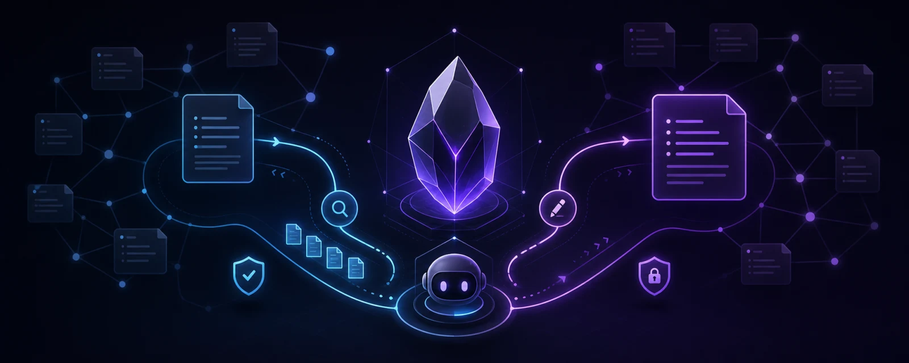
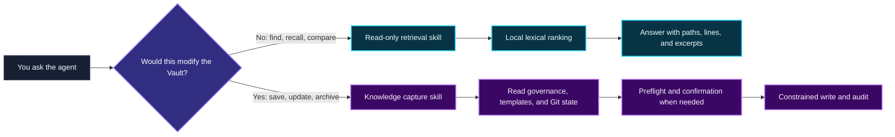

<p align="center">
  
</p>

<h1 align="center">Obsidian Knowledge Base Skill</h1>

<p align="center">
  <strong>Let AI agents safely retrieve, capture, and govern your Obsidian knowledge base</strong>
</p>

<p align="center">
  <a href="https://github.com/Spc-jgs/obsidian-kb-skill/releases/latest"></a>
  <a href="https://github.com/Spc-jgs/obsidian-kb-skill/actions/workflows/check.yml"></a>
  
  <a href="LICENSE"></a>
  
</p>

<p align="center">
  <a href="#install-with-your-agent-recommended">Quick install</a> ·
  <a href="#feature-map">Feature map</a> ·
  <a href="docs/README.md">Detailed guides</a> ·
  <a href="README.md">中文</a> ·
  <a href="CHANGELOG.md">Changelog</a>
</p>

<table>
  <tr>
    <td align="center"><strong>🔎 Read-only retrieval</strong><br><sub>Local ranking with file-and-line citations</sub></td>
    <td align="center"><strong>✍️ Governed capture</strong><br><sub>Writes only after explicit intent and preflight</sub></td>
    <td align="center"><strong>🧩 Multi-platform</strong><br><sub>Codex, QoderWork, WorkBuddy, Claude Code, and Cursor</sub></td>
  </tr>
</table>

One repository provides two skills with separate responsibilities: `obsidian-knowledge-retrieval` searches, cites, and answers without writing; `obsidian-knowledge-base` creates, updates, and governs notes only after explicit user authorization. The current stable release is **v1.31.0**.

## At a Glance



Retrieval never gains write access merely because editing might be useful. Capture never happens because of an ordinary question. If one request says “find this, then save the conclusion,” each skill still runs under its own permission boundary.

## Why This Exists

Architecture decisions, meeting outcomes, learning notes, and debugging discoveries often disappear when an AI conversation ends. Manual capture requires repeated decisions about folders, templates, tags, links, and indexes.

This project gives the agent the knowledge-management rules and delegates deterministic operations—path validation, retrieval, template rendering, index detection, and auditing—to local helpers. You only need to express intent:

```text
Search my Obsidian Vault for how we handled multi-agent handoffs.

Save the conclusions from this architecture review to my knowledge base.

Review this conversation for reusable problems, knowledge, reflection, and design; do not save low-value material.

Capture this article with its principles, practical steps, verification, and source evidence.
```

## Two Skills, Two Permission Boundaries

| | Read-only retrieval | Knowledge capture and governance |
|---|---|---|
| Skill | `obsidian-knowledge-retrieval` | `obsidian-knowledge-base` |
| Typical triggers | search, find, recall, compare, answer from the Vault | save, create, update, archive, remember |
| Vault writes | never | only after explicit intent and preflight |
| Main output | relative path, title, line, excerpt, match reason | note path, change summary, audit result |
| Local helpers | `search-vault`, `review-projects`, `vault-info`, `doctor` | create, update, categorize, index, link, and audit helpers |

Retrieval uses deterministic local lexical ranking. It needs no embedding model, vector database, persistent service, or network index. Titles, aliases, tags, headings, wikilinks, and body text receive different weights. A bilingual concept lexicon expands the query so a Chinese question reaches an English note, at reduced weight and with every added word reported back. See [Read-only retrieval](docs/retrieval.md).

## Feature Map

| Capability | What you get | Guide |
|---|---|---|
| Read-only knowledge retrieval | Search results and answers traceable to files and lines | [Retrieval](docs/retrieval.md) |
| Project revival radar | An explainable read-only queue for blocked or cooling projects | [Retrieval](docs/retrieval.md) |
| Eight built-in note types | Daily, meeting, learning, web, insight, project, person, digest | [Feature guide](docs/feature-guide.md) |
| Resilient web capture | Fast standard saves, safe alternate access, and verified escalation when needed | [Capture and governance](docs/capture-and-governance.md) |
| Verbatim source archives | Separate source evidence from knowledge notes with content hashes and reciprocal links | [Capture and governance](docs/capture-and-governance.md) |
| Conversation context and knowledge harvest | Layered context recovery plus selective durable-knowledge candidates | [Conversation guide](docs/conversations.md) |
| Vault-specific governance | Honors `AGENTS.md`, custom templates, folders, and index ownership | [Capture and governance](docs/capture-and-governance.md) |
| Safe create and update | Dry runs, path boundaries, template hashes, Git checks, post-write audits | [Feature guide](docs/feature-guide.md) |
| Categories and Inbox | Confirmed category creation and plan-before-move Inbox processing | [Capture and governance](docs/capture-and-governance.md) |
| Links and indexes | Wikilink suggestions plus Folder Index, Dataview, and static INDEX support | [Capture and governance](docs/capture-and-governance.md) |
| Task Memory | Optional bounded handoff logs and backups for long multi-agent tasks | [Capture and governance](docs/capture-and-governance.md) |
| Installation diagnostics | Multi-platform install, payload checks, and both skill doctors | [Platforms and installation](docs/platforms-and-installation.md) |

The [complete feature guide](docs/feature-guide.md) lists note types, commands, and default safety policies.

## Before You Start

- Python 3.11 or newer;
- an existing Obsidian Vault, or a directory that will become one;
- an AI agent that supports skills or project rules.

## Install with Your Agent (Recommended)

Send this prompt to Codex, QoderWork, WorkBuddy, Claude Code, Cursor, or another agent with terminal and filesystem access:

```text
Install the latest stable Obsidian Knowledge Base Skill from the official repository:
https://github.com/Spc-jgs/obsidian-kb-skill

Read the README, installer help, and CHANGELOG before using the official installer. Detect my current agent platform and Obsidian Vault; ask me if either cannot be determined reliably. Do not guess paths, overwrite my custom templates, or disturb other platform configuration.

After installation, run doctor --json for both the write and retrieval skills from outside the repository, then run one read-only retrieval smoke test. Report the version, Vault path, installed platforms, installation locations, and verification results. Stop on failure; never delete or rebuild my Vault.
```

See [Getting started](docs/getting-started.md) for the full first-run workflow and acceptance checks.

## Manual Installation and Downloads

### Clone with Git

```bash
git clone https://github.com/Spc-jgs/obsidian-kb-skill.git
cd obsidian-kb-skill
```

You can also use GitHub's **Code → Download ZIP** and extract the archive.

macOS / Linux:

```bash
chmod +x install.sh
./install.sh --vault "/path/to/your/Vault"
```

Windows PowerShell:

```powershell
.\install.ps1 -VaultPath "C:\path\to\your\Vault"
```

A first install must name the Vault explicitly. Later runs reuse the path saved in `~/.obsidian-kb-config`, so the argument can be omitted then.

The installer initializes missing folders and templates, installs platform entrypoints and the private helper runtime, and verifies both skills from a neutral directory.

To inspect installer options:

```bash
./install.sh --help
```

```powershell
.\install.ps1 -Help
```

A standard skill requires its complete directory:

- [skills/obsidian-knowledge-base/SKILL.md](skills/obsidian-knowledge-base/SKILL.md)
- [skills/obsidian-knowledge-retrieval/SKILL.md](skills/obsidian-knowledge-retrieval/SKILL.md)

**Copying one instruction file is neither a complete standard Skill nor a way to initialize a Vault.** Claude Code and Cursor write-compatible entrypoints still depend on the product runtime deployed by the installer. See [Platforms and installation](docs/platforms-and-installation.md) for platform differences, install paths, upgrades, and uninstall behavior.

## Supported Platforms

| Platform | Write entrypoint | Read-only retrieval entrypoint |
|---|---|---|
| Codex / Agent Skills | `~/.agents/skills/obsidian-knowledge-base/` | `~/.agents/skills/obsidian-knowledge-retrieval/` |
| QoderWork / Qoder CLI | `~/.qoderwork/skills/obsidian-knowledge-base/` | `~/.qoderwork/skills/obsidian-knowledge-retrieval/` |
| WorkBuddy | `~/.workbuddy/skills/obsidian-knowledge-base/` | `~/.workbuddy/skills/obsidian-knowledge-retrieval/` |
| Claude Code | `~/.claude/skills/obsidian-knowledge-base/` | `~/.claude/skills/obsidian-knowledge-retrieval/` |
| Cursor | `~/.cursor/rules/obsidian-kb.mdc` | `~/.cursor/skills/obsidian-knowledge-retrieval/` |

One product can be installed for multiple platforms while sharing one Vault. On uninstall, only the product-owned WorkBuddy Skill directory is removed; unrelated WorkBuddy content is preserved. Platform selection, locale selection, config precedence, and uninstall boundaries are documented in [Platforms and installation](docs/platforms-and-installation.md).

## Documentation

The detailed guides are currently maintained in Chinese; this README keeps the complete English product overview, installation path, safety boundaries, and verification commands.

| Document | When to read it |
|---|---|
| [Documentation home](docs/README.md) | You are not sure where to begin |
| [Getting started](docs/getting-started.md) | First install, verification, and first prompts |
| [Complete feature guide](docs/feature-guide.md) | You want every capability and CLI entrypoint |
| [Read-only retrieval](docs/retrieval.md) | You want ranking, scope, citations, and limits |
| [Capture and governance](docs/capture-and-governance.md) | You want to create, update, clip, or govern notes |
| [Platforms and installation](docs/platforms-and-installation.md) | Multi-platform installs, upgrades, or uninstall |
| [Troubleshooting](docs/troubleshooting.md) | `doctor` fails or behavior is unexpected |
| [CHANGELOG](CHANGELOG.md) | Release changes and upgrade notes |

## Data and Privacy Boundaries

- Helpers run locally, call no cloud API, and create no persistent retrieval index or cache.
- The retrieval skill is always read-only and skips hidden directories, Obsidian internals, build outputs, and binary files.
- Paths must remain inside the configured Vault even after symlink resolution.
- Writes are preflighted, never overwrite same-name notes, and do not invent categories or resolve Git conflicts without authorization.
- Global settings live at `~/.obsidian-kb-settings.json`. Upgrades and default uninstall preserve it; only an explicit config purge removes it.
- If your agent uses a cloud-hosted model, note excerpts read for an answer may still be sent to that provider. A local helper does not imply a fully local model pipeline.

## Diagnostics

After installation, each skill runner works from outside the repository:

```bash
python <write-skill-root>/scripts/run_helper.py doctor --json
python <retrieval-skill-root>/scripts/run_helper.py doctor --json
python <retrieval-skill-root>/scripts/run_helper.py search-vault \
  "/your/Obsidian/Vault" --query "your query" --json
```

`doctor` checks the version, manifest, payload, Python runtime, dependencies, and packaged resources. See [Troubleshooting](docs/troubleshooting.md) when a check fails.

## Development and Contributing

The repository follows a source → generated artifact → installed artifact model. Do not edit generated files under `skills/` or `platforms/` directly; change their source of truth and run the build checks.

Install development dependencies:

```bash
uv sync --locked --extra dev
```

Verify:

```bash
uv run python build.py --check
uv run --no-sync python -m pytest
uv lock --check
```

Without `uv`:

```bash
python -m pip install --upgrade pip setuptools wheel
python -m pip install -e ".[dev]"
python -m pytest
```

The repository tests and [CHANGELOG.md](CHANGELOG.md) define the release, generation, and versioning contracts.

## FAQ

**Does this require an Obsidian plugin?**

No. A Vault is a Markdown directory. The project can also respect Folder Index and Dataview ownership when they are present.

**Does retrieval use local embeddings?**

No. The current stable release uses local lexical ranking by default. Embeddings remain a possible future provider, not a current dependency.

**Does it record every conversation automatically?**

No. Ordinary questions do not write. Only explicit save or update intent triggers the write skill.
An analysis-only request asking what is worth capturing returns Conversation Harvest candidates without creating a note.

**Why can my agent not find the skill?**

Confirm that installation targeted a directory the current platform actually scans, restart or create a fresh agent session, then run `doctor --json`. See [Troubleshooting](docs/troubleshooting.md).

## License

[MIT](LICENSE)
