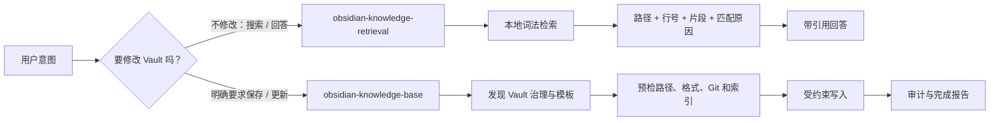

# Obsidian Knowledge Base Skill 使用文档

这里是面向使用者的完整指南。根目录 [README](../README.md) 负责快速理解和上手；本目录解释每项能力的适用场景、操作方式、安全边界和常见问题。

## 从哪里开始

| 你的目标 | 建议阅读 |
|---|---|
| 第一次安装并完成验证 | [快速开始](getting-started.md) |
| 了解目前到底有哪些功能 | [完整功能指南](feature-guide.md) |
| 从 Vault 搜索、引用和回答问题 | [只读检索](retrieval.md) |
| 创建、更新、剪藏、治理笔记 | [知识沉淀与治理](capture-and-governance.md) |
| 保存对话上下文或提炼对话知识 | [对话上下文恢复与知识萃取](conversations.md) |
| 查看各 Agent 的安装位置和差异 | [平台与安装](platforms-and-installation.md) |
| 安装失败、检索不到或 doctor 报错 | [故障排查](troubleshooting.md) |

## 两条互不混淆的工作流

- 检索 Skill 永远只读，不包含写入 helper。
- 写入 Skill 只有在用户明确提出保存、创建、更新、归档或记忆时才触发。
- “先查一下”不会自动变成“顺便改一下”；组合请求也会先完成检索，再单独进入写入预检。

## 文档边界

- 版本变化：[CHANGELOG.md](../CHANGELOG.md)
- 设计与实现决策：[docs/superpowers/specs](superpowers/specs/)
- 版本化验收报告：[docs/evals](evals/)
- Skill 内部工作流：`core/references/` 与 `core/retrieval-references/`

Skill 包本身只包含执行任务所需的 `SKILL.md`、references、scripts 和 assets；面向人的安装教程、FAQ 和发布说明统一留在仓库文档中，避免增加 Agent 的常驻上下文。
