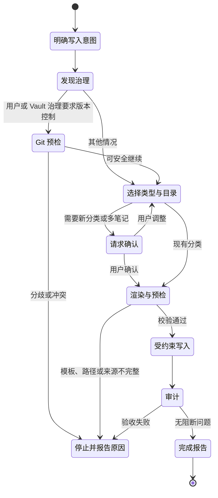

# 知识沉淀与治理

`obsidian-knowledge-base` 只在用户明确要求保存、创建、更新、归档或记忆时触发。它不是自动记录器，也不会因为一次普通讨论就修改 Vault。

## 写入状态机



## 普通笔记创建

写入 Skill 会：

1. 读取 Vault `AGENTS.md` 和更具体的子目录规则；
2. 发现现有目录、模板和索引所有权；
3. 选择笔记类型与目标目录；
4. 合并模板和结构化 frontmatter；
5. 在写入前校验路径、模板、来源和 Git；
6. 使用原生文件工具或 `create-note` helper；
7. 审计结果后才报告完成。

`create-note` 默认 dry-run：

```bash
obsidian-create-note "/你的/Vault" \
  --type insight-note \
  --title "缓存一致性取舍" \
  --content-file body.md \
  --preflight-json
```

预检会把校验过的输入按返回的 `content.sha256` 暂存下来，正式应用时直接引用，
不必把同一篇正文再传一遍：

```bash
obsidian-create-note "/你的/Vault" \
  --type insight-note \
  --title "缓存一致性取舍" \
  --from-preflight <content.sha256> \
  --apply --compact-json
```

helper 会重新渲染并重新哈希，结果不一致就拒绝写入，因此这条捷径比重传更严格，
而不是更宽松。暂存目录在 Vault 之外（`~/.obsidian-kb-preflight`，可用
`OBSIDIAN_KB_PREFLIGHT_CACHE` 覆盖），dry-run 不会碰 Vault 一个字节；条目 24
小时后过期，届时按 `unknown-preflight-content` 的提示重传正文即可。

如果预检报的是 `missing-template-heading`，而每个必需小节其实都写了、只是 ATX
层级不对，`validation.suggested_fix` 会给出逐行修改；用
`--from-preflight <sha256> --fix-heading-levels` 重跑预检即可应用，同样不必重传。
小节缺失、改名或乱序属于内容问题，工具不会替你猜。

它不会覆盖同名文件；冲突时使用稳定后缀或停止。

## 网页文章沉淀

文章、博客、论文或文字稿使用 `web-clip`，但不再把每一次“沉淀一下”都升级
为昂贵的深度研究：

| 深度 | 适用场景 | 验收方式 |
|---|---|---|
| `standard` | 普通文章觉得有价值，希望快速形成可独立阅读的笔记 | 来源忠实、正文和重要素材完整、按需就近标注未核实主张 |
| `verified` | 明确要求求证、研究、复现，或用于高风险/重要决策 | 完整来源清单、覆盖台账、数字与推论证据、capture receipt |

两种深度共用一套 Web Clip 模板。`standard` 是普通沉淀的默认值，不要求
capture receipt；`verified` 才加载完整深度契约并绑定候选正文哈希。

### 获取网页不是“一次失败就结束”

Agent 首次访问遇到挑战页、空壳、截断或正文缺失时，需要在安全且合理的范围内
尝试另一种实质不同的访问方式，例如浏览器渲染、公开 reader 表示或官方材料。
Skill 不绑定某一个工具，也不会把 Jina 之类的 reader 当成唯一方案。

- 公开 URL 可以交给第三方 reader；
- 登录态、私有、内网、签名或含秘密的 URL 不得发送给第三方；
- 不绕过登录、CAPTCHA、付费墙或访问控制；
- 评论区默认不在范围内；
- 正文图片都要判断是否重要，重要图片必须真正读懂，不能只保留 URL/alt；
- 正文、代码、表格、附件或必要链接缺少关键部分时，完成态沉淀失败。

失败时保持零写入，说明缺了什么和试过什么，再让用户选择提供内容或明确保存
一个不完整的 Inbox 书签。Agent 不会自动降级，也不会把“访问失败”占位符写成
知识笔记。

### 求证力度

普通沉淀可自动完成低成本的一手来源核对。新软件的常规安装或操作步骤通常无需
额外研究；科学、证据性或会影响重要决定的知识主张应优先求证，无法低成本求证
时就近注明。

例如“1000 并发下 A 比 B 快 40%”在缺少样本、环境和基准方法时属于
`source-self-report`（作者自测），不是可以直接采信的事实，也不能简单归为
“作者观点”。需要多来源研究或重新跑 benchmark 时，先征得用户同意，再升级为
`verified`。

## AI 对话

保存 AI 对话时先按未来用途分流：

- `conversation-digest` 保存一次讨论的不可变上下文快照；
- Task Memory 维护活跃任务的可变当前态；
- Conversation Harvest 分析哪些问题、知识、反思和设计值得长期保存。

Digest v2 使用“恢复卡片 + 详细上下文”的分层结构。恢复卡片在 30 秒内给出
目标、状态、当前结论、下一步和关键产物；后续章节保留边界、决定理由、证据及
开放问题，不再用约 250 词限制整篇笔记。

Harvest 默认只返回带 `verified / inferred / open / skip` 状态的候选清单。
只有一个高价值候选、目标类型明确且用户明确授权保存时，才继续普通笔记创建；
多个独立候选先让用户选择，仍遵守一次最多创建一篇的边界。

完整提示词、结构和验收方法见
[AI 对话的上下文恢复与知识萃取](conversations.md)。

## 自定义模板

Vault 的 `Templates/` 是实际模板来源。helper 会识别模板与项目默认版本的差异：

- 未修改模板走轻量路径；
- 自定义模板通过 `template-contract` 返回选中模板的结构；
- 写入预检绑定模板 SHA-256，防止 Agent 按旧模板理解写入。

安装器默认不覆盖已有模板。只有显式 `--force` / `-Force` 才刷新它们。

## 新分类

普通笔记不能顺手创建缺失目录。需要新主题时：

1. Agent 提议稳定目录路径；
2. 用户可以确认或改名；
3. `create-category --preflight-json` 返回目录与索引计划；
4. 只有 `--confirmed --apply` 才创建；
5. 首篇笔记与新分类索引按治理规则一起验收。

这避免分类树被一次临时对话随意扩张。

目标目录已经拥挤时，判断“该不该拆子分类”不需要把目录里的笔记读一遍：
`vault-info` 会在 `crowded_folders` 里一并给出 `child_folders`（可复用的既有
子分类）和 `clusters`（由标签与标题词统计出的主题及其笔记数，已剔除每篇都带的
类型默认标签）。规则要求的“五篇以上稳定主题”就对着 `cluster_min_notes` 判断；
`clusters` 为空本身就是答案：这个目录拥挤，但没有可拆的稳定主题。

哪些标签算“类型默认”，读的是**你这个 Vault 自己的 `Templates/*.md`**，不是一份写死的
列表 —— 模板把 `person` 改成 `people` 能跟上，`java` 这种真实主题也不会因为在别处看着
像通用词而被丢掉。

如果你的命名约定让某些词长期占名额（典型是剪藏前缀，`2026-07-24 掘金文章-…` 会让
`掘金文` 一直上榜），在 `.obsidian-kb/vault-vocabulary.json` 里声明它们不是主题：

```json
{
  "schema_version": 1,
  "non_subject_terms": ["掘金文章", "微信公众号"]
}
```

每条声明按标题同样的方式分词，产出的词元一起剔除 —— 写 `掘金文章` 就会同时去掉
`掘金`、`金文`、`文章`，只去掉最后一个的话前两个会重新合并回 `掘金文`。上限
16 KiB / 100 条 / 每条 2–40 字符。站点名不写进内置词表：对做剪藏的 Vault 它是噪声，
对写“掘金这个平台”的人它是正当主题，只有你知道是哪种。文件写坏时 `vault-info` 用
`invalid-vault-vocabulary` 拒绝，而不是忽略它 —— 忽略等于把你说过不算主题的词重新
当建议报回来。

## 索引所有权

| 模式 | 谁维护目录成员 | Agent 行为 |
|---|---|---|
| Folder Index | 插件 | 使用目录同名索引，不手工追加成员 |
| Dataview | 查询 | 保留查询，不写渲染结果 |
| 静态 INDEX | Markdown 文件 | helper 可追加经过校验的链接 |

`detect-index` 负责识别模式。Folder Index 1.0.30 的图谱依赖目录同名索引；统一改成 `INDEX.md` 可能破坏父子图谱边。

## Inbox、链接与审计

预览 Inbox 归档：

```bash
obsidian-process-inbox "/你的/Vault" --plan
```

确认后执行：

```bash
obsidian-process-inbox "/你的/Vault" --apply
```

链接建议：

```bash
obsidian-suggest-links "/你的/Vault" \
  --note "30-Insights/某笔记.md" --top-n 10
```

链接 helper 只返回候选和理由，不写文件。写入 Skill 只采用 Vault 中真实存在、关系明确的链接。

全库审计：

```bash
obsidian-audit-vault "/你的/Vault" --strict
```

审计覆盖 frontmatter、模板结构、代码围栏、wikilink、目录索引、文章完整性和泄漏的模板指令等；审计器自身只读。

每条 finding 带严重度，可用 `--min-severity` 过滤：

| 级别 | 含义 | 处理 |
|---|---|---|
| `defect` | 导航、渲染或工具链已经坏了，或未完成的模板脚手架进了正文 | 该修 |
| `hygiene` | 一致性与完整性问题，不影响使用 | 有空再修 |
| `informational` | 往往本来就没问题——独立笔记、两个相似标题 | 用户问起再报 |

```bash
obsidian-audit-vault "/你的/Vault" --min-severity defect
```

## Task Memory 与备份

Task Memory 用于多 Agent 长任务交接，默认关闭。开启后使用 `Tasks/<slug>/TASK.md` 保存受约束状态：

- 只修改指定 frontmatter；
- 只追加带时间戳的 Log；
- 不覆盖自由正文；
- 写前创建有限备份；
- Log 保留有界条数。

全局备份策略位于 `~/.obsidian-kb-settings.json`，`backup.keep_per_note` 默认是 `1`，支持 1–1000。清理由 helper 执行，Agent 不自行遍历或删除备份。

### 备份的适用边界

备份**只服务 Task Memory**，这是刻意的设计，不是覆盖不全。

普通笔记的恢复机制是 **Git**：Vault 预期是一个 Git 仓库，每次沉淀对应一次提交，历史、diff、提交信息、远端一应俱全。`.obsidian-kb-backups/` 默认被 `.gitignore` 排除，是本地快照而非版本历史。给普通笔记再加一层 helper 备份，等于用一个更弱的机制重复 Git 已经做得更好的事——没有 diff、没有信息、历史深度受 `keep_per_note` 限制，而且因为该目录被搜索、审计和索引一并排除，没人看得见。

Task Memory 是例外：它一天可能改动多次，每次都进 Git 会污染「一次提交 = 一次有意义的沉淀」的历史，所以用有界的本地快照更合适。

其余写入路径不需要备份：`create-note` 永不覆盖（重名追加数字后缀）；`process-inbox` 是移动，内容先落到目标位置再删源，且 `dest.exists()` 会挡住覆盖，自 v1.25.1 起无法解析的 frontmatter 会被直接拒绝而不是改写。

如果你的备份目录里存在旧版本遗留的条目（例如脚手架文件或 `LATEST`），清理时会看到 `retained unknown backup item` 警告。该警告是正确的，这些是历史残留，可以手动删除。

设计依据见 `docs/superpowers/specs/2026-08-01-backup-boundary-decision.md`。
