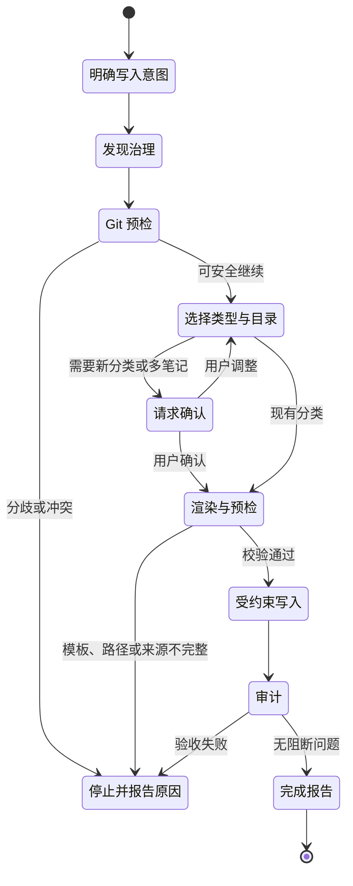

# 知识沉淀与治理

`obsidian-knowledge-base` 只在用户明确要求保存、创建、更新、归档或记忆时触发。它不是自动记录器，也不会因为一次普通讨论就修改 Vault。

## 写入状态机



## 普通笔记创建

写入 Skill 会：

1. 读取 Vault `AGENTS.md` 和更具体的子目录规则；
2. 发现现有目录、模板和索引所有权；
3. 选择笔记类型与目标目录；
4. 合并模板和结构化 frontmatter；
5. 在写入前校验路径、模板、来源和 Git；
6. 使用原生文件工具或 `create-note` helper；
7. 审计结果后才报告完成。

`create-note` 默认 dry-run：

```bash
obsidian-create-note "/你的/Vault" \
  --type insight-note \
  --title "缓存一致性取舍" \
  --content-file body.md \
  --preflight-json
```

正式应用：

```bash
obsidian-create-note "/你的/Vault" \
  --type insight-note \
  --title "缓存一致性取舍" \
  --content-file body.md \
  --apply --compact-json
```

它不会覆盖同名文件；冲突时使用稳定后缀或停止。

## 深度文章沉淀

文章、博客、论文或文字稿在用户要求“学习、沉淀、整理成知识”时走 `web-clip` 深度路径。完成笔记应能脱离原链接独立回答：

- 解决什么问题，适用边界是什么；
- 原理和因果链是什么；
- 依赖、版本、配置、命令、代码和执行顺序是什么；
- 如何验证成功，预期结果是什么；
- 会在哪里失败，有哪些限制；
- 哪些是来源事实，哪些是 Agent 推论；
- 能迁移出什么方法和启发。

来源正文、关键图片、附件或代码不可访问时，停止正式沉淀；可以按用户意图放入 `00-Inbox` 作为稍后阅读来源，但不能冒充完整知识文章。

深度写入使用结构化 capture receipt，把来源覆盖、重要事实、数字、推论和实践证据绑定到候选正文哈希，避免“机械审计通过但内容遗漏”。

## AI 对话

保存 AI 对话时先按未来用途分流：

- `conversation-digest` 保存一次讨论的不可变上下文快照；
- Task Memory 维护活跃任务的可变当前态；
- Conversation Harvest 分析哪些问题、知识、反思和设计值得长期保存。

Digest v2 使用“恢复卡片 + 详细上下文”的分层结构。恢复卡片在 30 秒内给出
目标、状态、当前结论、下一步和关键产物；后续章节保留边界、决定理由、证据及
开放问题，不再用约 250 词限制整篇笔记。

Harvest 默认只返回带 `verified / inferred / open / skip` 状态的候选清单。
只有一个高价值候选、目标类型明确且用户明确授权保存时，才继续普通笔记创建；
多个独立候选先让用户选择，仍遵守一次最多创建一篇的边界。

完整提示词、结构和验收方法见
[AI 对话的上下文恢复与知识萃取](conversations.md)。

## 自定义模板

Vault 的 `Templates/` 是实际模板来源。helper 会识别模板与项目默认版本的差异：

- 未修改模板走轻量路径；
- 自定义模板通过 `template-contract` 返回选中模板的结构；
- 写入预检绑定模板 SHA-256，防止 Agent 按旧模板理解写入。

安装器默认不覆盖已有模板。只有显式 `--force` / `-Force` 才刷新它们。

## 新分类

普通笔记不能顺手创建缺失目录。需要新主题时：

1. Agent 提议稳定目录路径；
2. 用户可以确认或改名；
3. `create-category --preflight-json` 返回目录与索引计划；
4. 只有 `--confirmed --apply` 才创建；
5. 首篇笔记与新分类索引按治理规则一起验收。

这避免分类树被一次临时对话随意扩张。

## 索引所有权

| 模式 | 谁维护目录成员 | Agent 行为 |
|---|---|---|
| Folder Index | 插件 | 使用目录同名索引，不手工追加成员 |
| Dataview | 查询 | 保留查询，不写渲染结果 |
| 静态 INDEX | Markdown 文件 | helper 可追加经过校验的链接 |

`detect-index` 负责识别模式。Folder Index 1.0.30 的图谱依赖目录同名索引；统一改成 `INDEX.md` 可能破坏父子图谱边。

## Inbox、链接与审计

预览 Inbox 归档：

```bash
obsidian-process-inbox "/你的/Vault" --plan
```

确认后执行：

```bash
obsidian-process-inbox "/你的/Vault" --apply
```

链接建议：

```bash
obsidian-suggest-links "/你的/Vault" \
  --note "30-Insights/某笔记.md" --top-n 10
```

链接 helper 只返回候选和理由，不写文件。写入 Skill 只采用 Vault 中真实存在、关系明确的链接。

全库审计：

```bash
obsidian-audit-vault "/你的/Vault" --strict
```

审计覆盖 frontmatter、模板结构、代码围栏、wikilink、目录索引、文章完整性和泄漏的模板指令等；审计器自身只读。

## Task Memory 与备份

Task Memory 用于多 Agent 长任务交接，默认关闭。开启后使用 `Tasks/<slug>/TASK.md` 保存受约束状态：

- 只修改指定 frontmatter；
- 只追加带时间戳的 Log；
- 不覆盖自由正文；
- 写前创建有限备份；
- Log 保留有界条数。

全局备份策略位于 `~/.obsidian-kb-settings.json`，`backup.keep_per_note` 默认是 `1`，支持 1–1000。清理由 helper 执行，Agent 不自行遍历或删除备份。
