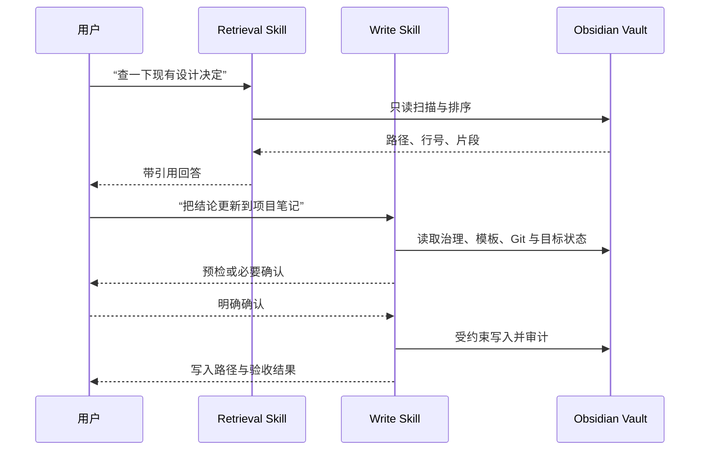

# 完整功能指南

## 功能总览

| 能力 | 做什么 | 默认是否写入 Vault | 主要入口 |
|---|---|---:|---|
| 只读知识检索 | 按标题、别名、标签、标题层级、wikilink 和正文排序，并做双语概念词表查询扩展 | 否 | `obsidian-knowledge-retrieval` |
| 带引用回答 | 返回相对路径、标题、行号、片段和匹配原因 | 否 | `search-vault` |
| 项目复苏雷达 | 找出受阻、失温或缺少活动日期的项目，并给出已有下一步 | 否 | `review-projects` |
| 声明式检索视图 | 运行 Vault 自己写下的检索条件，返回结果与解析后的查询计划；相对时间窗由调用方给定日期换算 | 否 | `run-retrieval-view` |
| 知识邻域探索 | 展示 Vault 已经声明的连接：正文 wikilink、frontmatter `related` 与反向链接，一跳有界，不评分不推荐 | 否 | `explore-neighborhood` |
| Vault 结构发现 | 返回 Vault 有效性、标准目录、模板、索引配置、拥挤目录的主题聚类，以及本次操作需要加载的参考文件清单 | 否 | `vault-info` |
| Vault 治理读取 | 读取 `AGENTS.md` / `CLAUDE.md` 等 Vault 本地治理规则 | 否 | Agent 自行读取，非 helper |
| 笔记创建 | 路由类型、合并 frontmatter、套用模板、避免覆盖 | 仅 `--apply` | `create-note` |
| 韧性网页沉淀 | 普通文章快速沉淀；需要时升级为可求证的深度捕获 | 需明确保存意图 | 写入 Skill |
| 原文证据归档 | 将原文按字节保存在 `95-Sources/`，记录哈希并与笔记双向链接 | 仅 `--apply` | `archive-source` |
| 对话上下文恢复 | 用分层 Digest 保存目标、状态、决定、证据和下一步 | 需明确保存意图 | `conversation-digest` |
| 对话知识萃取 | 识别问题、知识、反思和设计候选并判断长期价值 | 分析默认不写 | `conversation-harvest.md` 工作流，非 helper |
| 会议/学习/洞察/项目/人物 | 使用八种预置模板和 Vault 自定义模板 | 需明确保存意图 | 写入 Skill |
| 新分类创建 | 先预检，再经用户确认创建目录和索引 | 仅确认后 | `create-category` |
| Inbox 归档 | 推断目标类型与目录，先计划后移动 | 默认否 | `process-inbox` |
| 链接建议 | 在受限候选集中解释关联原因 | 否 | `suggest-links` |
| Vault 审计 | 检查 frontmatter、模板、链接、索引和文章完整性 | 否 | `audit-vault` |
| 自定义模板识别 | 识别模板变化并绑定模板哈希，避免陈旧解释 | 否 | `template-contract` |
| 索引兼容 | 支持 Folder Index、Dataview 和静态 INDEX | 按所有权决定 | `detect-index` |
| Task Memory | 多 Agent 长任务的可选交接日志 | 默认关闭 | `update-note` |
| 写前备份 | 更新任务记忆前按全局策略保留有限备份 | 更新时 | helper 内部 |
| 安装诊断 | 校验 manifest、payload、Python、依赖和资源 | 否 | `doctor` |

## 两个 Skill 如何配合



检索不会隐式触发写入。即使一句话同时包含“先找再保存”，也要先完成只读证据收集，再让写入 Skill 独立执行自己的授权和预检。

## 预置笔记类型

| 类型 | 默认目录 | 适合内容 |
|---|---|---|
| `daily-note` | `15-Daily/` | 日记、计划、复盘 |
| `meeting-note` | `10-Work/` | 会议、评审、站会 |
| `learning-note` | `20-Learning/` | 课程、书籍、普通学习 |
| `web-clip` | `20-Learning/` | 完整文章、博客、论文沉淀 |
| `insight-note` | `30-Insights/` | 洞察、分析、AI 对话结论 |
| `project-note` | `40-Projects/` | 项目目标、进展、风险 |
| `person-note` | `50-People/` | 人物、角色、互动与跟进 |
| `conversation-digest` | `30-Insights/` 或具体项目目录 | AI 对话上下文、决定依据、证据和后续行动 |

实际路由优先服从 Vault 根目录及子目录的 `AGENTS.md`，再使用项目默认值。

## CLI 入口

安装 wheel 或 `.[dev]` 后可使用：

```text
obsidian-audit-vault
obsidian-archive-source
obsidian-capture-receipt
obsidian-create-category
obsidian-create-note
obsidian-detect-index
obsidian-explore-neighborhood
obsidian-process-inbox
obsidian-review-projects
obsidian-run-retrieval-view
obsidian-scaffold-templates
obsidian-search-vault
obsidian-suggest-links
obsidian-template-contract
obsidian-update-note
obsidian-vault-info
```

通过安装器部署的 Skill 使用：

```bash
python <skill-root>/scripts/run_helper.py <helper> ...
```

所有支持 `--json` 的命令都会输出一个完整 JSON 文档，适合 Agent 或自动化工具消费。

## 默认安全策略

- 不因普通问答自动保存。
- 只在配置的 Vault 根目录内解析路径，并在解析 symlink 后再次校验边界。
- 创建不覆盖同名文件；更新只修改受约束区域。
- 网页首次获取失败会尝试安全的不同表示；关键内容仍不完整时保持零写入。
- 普通 Web Clip 使用 `capture_depth: standard`，显式求证使用 `verified` 和 capture receipt。
- Folder Index 或 Dataview 拥有目录成员列表时，不由 Agent 重复维护。
- Git 分歧或冲突会停止，不自动解决索引冲突。
- 检索不联网、不创建持久索引或缓存、不包含写 helper。

## 对话分流

同一段 AI 对话按未来用途选择不同路径：

- 保存一次讨论的上下文和推理 → `conversation-digest`；
- 继续一个活跃的跨 Agent 任务 → `task-memory`；
- 判断哪些问题、知识、反思和设计值得复用 →
  `conversation-harvest`。

Digest v2 的 30 秒限制只用于首屏恢复卡片，正文可以保留安全续接所需的边界、
理由和证据。Harvest 是按需分析工作流，不是新的笔记类型；只在一个候选价值
明确且用户授权保存时，才路由到现有笔记类型。完整示例和验收标准见
[AI 对话的上下文恢复与知识萃取](conversations.md)。

继续阅读：

- [只读检索](retrieval.md)
- [知识沉淀与治理](capture-and-governance.md)
- [AI 对话的上下文恢复与知识萃取](conversations.md)
- [故障排查](troubleshooting.md)
