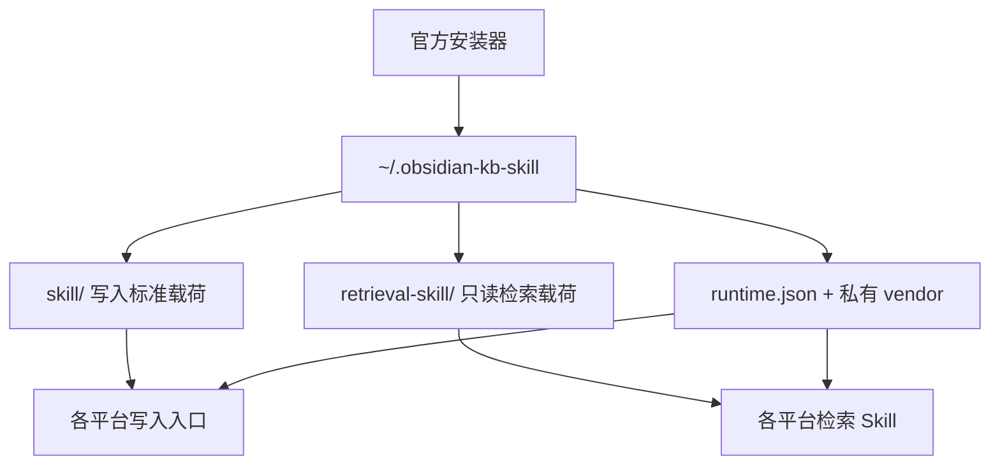

# 平台与安装

## 安装布局



## 平台矩阵

| 平台 | 写入入口 | 检索入口 |
|---|---|---|
| QoderWork / Qoder CLI | `~/.qoderwork/skills/obsidian-knowledge-base/` | `~/.qoderwork/skills/obsidian-knowledge-retrieval/` |
| OpenAI Codex | `~/.agents/skills/obsidian-knowledge-base/` | `~/.agents/skills/obsidian-knowledge-retrieval/` |
| WorkBuddy | `~/.workbuddy/skills/obsidian-knowledge-base/` | `~/.workbuddy/skills/obsidian-knowledge-retrieval/` |
| Claude Code | `~/.claude/skills/obsidian-knowledge-base/` | `~/.claude/skills/obsidian-knowledge-retrieval/` |
| Cursor | `~/.cursor/rules/obsidian-kb.mdc` | `~/.cursor/skills/obsidian-knowledge-retrieval/` |

除 Cursor 外，所有平台的写入与检索都使用原生标准 Skill 目录，按需加载。Cursor 的写入入口仍是常驻规则文件（`.mdc`），因为它没有等价的 Skill 发现机制。

Claude Code 自 v1.26.0 起改为原生 Skill 交付。此前写入 Skill 是 `~/.claude/CLAUDE.md` 里的标记块，会在**每一次对话**中无条件加载完整指令，与惰性加载的设计目标相悖。升级安装会自动移除该遗留块，并保留你自己在该文件中的其他内容；若标记块残缺不全，安装会中止且不修改文件。

## Vault 路径查找顺序

安装器按以下优先级查找：

1. `--vault` / `-VaultPath`
2. 仓库 `.env` 中的 `OBSIDIAN_KB_VAULT`
3. 环境变量 `OBSIDIAN_KB_VAULT`
4. `~/.obsidian-kb-config`

无法可靠确定时，应询问用户，不猜路径。

## 选择平台

macOS / Linux：

```bash
bash install.sh \
  --vault "/你的/Vault" \
  --platforms codex,workbuddy
```

Windows：

```powershell
.\install.ps1 `
  -VaultPath "D:\YourVault" `
  -Platforms "codex,workbuddy"
```

合法平台值：

```text
qoderwork,claude-code,codex,cursor,workbuddy
```

## 选择模板语言

```bash
bash install.sh --vault "/你的/Vault" --locale zh-CN
bash install.sh --vault "/你的/Vault" --locale en
```

Windows 使用 `-Locale zh-CN` 或 `-Locale en`。

已有模板默认保留，因此仅切换 locale 不会覆盖它们。确实需要替换时显式使用 `--force` / `-Force`，并先备份自己的模板修改。

## 安装器会修改什么

用户目录：

- `~/.obsidian-kb-config`
- `~/.obsidian-kb-settings.json`（仅首次创建）
- `~/.obsidian-kb-skill/`
- 所选平台的 Skill 或兼容入口

Vault：

- 创建缺失的标准目录；
- 创建缺失的八个模板；
- 创建缺失的根索引和受管目录索引；
- 创建缺失的 `.obsidian/app.json`。

默认升级不会覆盖已有模板、笔记或用户配置。安装器会从中立目录验证两个 Skill。

## 为什么不建议只复制一个 SKILL.md

标准 Skill 还依赖：

- `references/`
- `scripts/run_helper.py`
- bundled Python modules
- `manifest.json`
- 写入 Skill 的模板 assets

单独复制一个指令文件既不是完整标准 Skill，也不会初始化 Vault。需要手工安装时，应复制完整 Skill 目录并自行保证 Python 3.11+ 与 PyYAML 可用；更推荐官方安装器。

## 与 Skill 管理器共存

如果本机由 skill-hub 之类的管理器接管了 `~/.claude/skills/` 等位置，那些条目是指向管理器 store 的符号链接。安装器做六件事，其中只有一件与管理器冲突：

| 职责 | 产物 | 管理器能否替代 |
|---|---|---|
| Python 运行时 | `~/.obsidian-kb-skill/vendor/` | 否 |
| 解释器选择 | `~/.obsidian-kb-skill/runtime.json` | 否 |
| Vault 路径配置 | `~/.obsidian-kb-config` | 否 |
| Vault 结构与模板 | Vault 内的目录与 `Templates/` | 否 |
| 诊断副本 | `~/.obsidian-kb-skill/skill/` 等 | 否（不冲突） |
| **各平台 Skill 分发** | `~/.claude/skills/` 等五处 | **是** |

前五件没有管理器提供，所以「只用管理器」会得到一个缺少 vendor 与 Vault 配置的安装，helper 第一次调用就 `ModuleNotFoundError`。用 `--runtime-only` 只做前五件：

```bash
bash install.sh --vault "/你的/Vault" --runtime-only
```

```powershell
.\install.ps1 -VaultPath "C:\你的\Vault" -RuntimeOnly
```

然后照常用管理器安装两个 Skill。顺序无所谓，两边互不依赖。

`--runtime-only` 与 `--platforms` 不能同时给：前者不写任何平台文件，后者没有可选的东西，静默接受其中一个会让你以为另一个生效了。

默认模式（不加 `--runtime-only`）现在也不会破坏管理器的链接：指向本 checkout 之外的 Skill 目录符号链接会被跳过并报出目标，结尾给出跳过数量。`--force` / `-Force` 可以覆盖，但那会把链接换成真实目录，管理器随后会报 drift。

## 升级

```bash
git pull --ff-only
bash install.sh --vault "/你的/Vault"
```

**由管理器接管 Skill 位置时，升级命令是 `--runtime-only` 那条**，再让管理器刷新它自己的副本。重跑默认安装不会再破坏链接，但也不会更新管理器 store 里的内容。

升级后验证：

```bash
python ~/.agents/skills/obsidian-knowledge-base/scripts/run_helper.py \
  doctor --json
python ~/.agents/skills/obsidian-knowledge-retrieval/scripts/run_helper.py \
  doctor --json
```

## 卸载边界

默认卸载：

- 删除产品拥有的 Skill 目录和兼容入口；
- 删除私有 support runtime；
- 安全移除 Claude Code / 旧 AGENTS marker block；
- 保留 Vault、笔记、Vault 路径配置和备份策略配置；
- 保留同级的其他 Skill。

WorkBuddy 卸载只删除产品拥有的 WorkBuddy Skill 目录，不处理其他 Skill。只有显式 config purge 才删除 `~/.obsidian-kb-config` 和 `~/.obsidian-kb-settings.json`。
